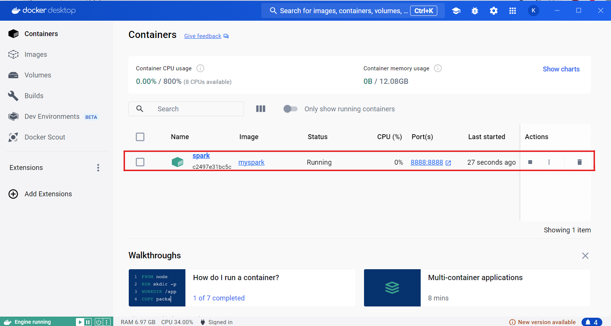

# SparkSQL in Docker Project

## **Description**

Mục tiêu của project này là cài đặt và chạy SparkSQL trong một Docker container. Container này sẽ lưu trữ một cơ sở dữ liệu (cụ thể là SQLite database) và cho phép thực hiện các truy vấn SQL sử dụng SparkSQL.

## **Prerequisites**

Trước khi bắt đầu project, hãy đảm bảo rằng máy tính đủ bộ nhớ (tối thiểu 30GB) và đã cài đặt Docker. Để đơn giản, dự án sử dụng Docker Desktop với một giao diện dễ nhìn và dễ thực hiện. Ta có thể tải về trên trang web [Docker Desktop](https://www.docker.com/products/docker-desktop/) tùy theo hệ điều hành máy sử dụng.


## **Installation**

**Bước 1:** Tạo một file `Dockerfile` với nội dung như sau:

```
# Use an image of Java
FROM openjdk:8-jdk

# Install python, sqlite3 and some necessary tool
RUN apt-get update && \
    apt-get install -y wget python3 python3-pip sqlite3

# Install Spark
RUN wget https://archive.apache.org/dist/spark/spark-3.5.1/spark-3.5.1-bin-hadoop3.tgz && \
    tar xvf spark-3.5.1-bin-hadoop3.tgz && \
    mv spark-3.5.1-bin-hadoop3 /opt/spark && \
    rm spark-3.5.1-bin-hadoop3.tgz

# Install PySpark and Jupyter
RUN pip3 install pyspark notebook pandas

# Add Spark to PATH
ENV PATH=$PATH:/opt/spark/bin

# Set the working directory
WORKDIR /workspace

COPY  createdb.ipynb ./createdb.ipynb
COPY  ./bankdataset.csv ./bankdataset.csv
COPY  query.ipynb ./query.ipynb

# Expose ports for Jupyter Notebook
EXPOSE 8888

# Start Jupyter Notebook
CMD ["jupyter", "notebook", "--ip=0.0.0.0", "--allow-root", "--no-browser"]
```
Ở đây, dự án sử dụng một Docker image base từ [Docker Hub](https://hub.docker.com/) là OpenJDK, một image base phổ biến cho ứng dụng Java, sau đó cài đặt Python, Spark và Hadoop vào trong đó. Mục đích chung là chuẩn bị cho Pyspark, do đó ta có thể thay đổi thứ tự cài đặt ví dụ như sử dụng image base cho Python sau đó cài đặt Java, Spark, Hadoop. Bên cạnh đó dự án cài đặt cơ sở dữ liệu SQLite và công cụ Pip để tải các gói thư viện trong Python.

Tiếp theo, dự án cài đặt các Jupyter Notebook để thực hiện các câu lệnh dễ nhìn hơn. Cuối cùng đặt working directory, copy các file cần thiết và đặt cổng ra cho Jupyter Notebook là 8888. Như vậy ta đã chuẩn bị các cài đặt cơ bản cho một Container.

**Bước 2:** Xây dựng Docker Image:

Để xây dựng Docker image ta sử dụng câu lệnh sau và đặt tên là `myspark`.
```
docker build . -t myspark
```
Sau đó, ta chạy Image đó với cổng 8888 và tên là `spark`.
```
docker run -p 8888:8888 --name spark -d myspark
```
Khi đó trong Docker Desktop sẽ xuất hiện một Image như sau:



Chọn vào Image đó, ta sẽ tìm được một đường link truy cập vào  trang chủ Jupyter Notebook.


Ở đây ta cần token đăng nhập máy chủ localhost để truy cập Jupyter Notebook.

Ta có thể tìm token ở Docker Desktop bằng cách tìm đến một đường link như trong hình. Ví dụ đường link ở đây là: `http://127.0.0.1:8888/tree?token=58751512352a57fd368dab1606423f4c6b281669cb3a2764`, token chính là `58751512352a57fd368dab1606423f4c6b281669cb3a2764`.


Sau khi có được token, ta Log in để truy cập tới Jupyter Notebook.


Như vậy bước cài đặt đã thành công và trong các bước sau ta sẽ thực hiện một số các câu lệnh truy vấn trong Pyspark.

# **Implementation**

**Bước 1:** Tạo cơ sở dữ liệu:

Ta sẽ tạo một cơ sở dữ liệu ở đây. Dự án đã chuẩn bị một file `createdb.ipynb` giúp ta tạo ra một cơ sở dữ liệu SQLite bằng sqlite3.

```
import sqlite3
import random
import string
import pandas as pd

data = pd.read_csv('/workspace/bankdataset.csv')
# Connect to SQLite database (creates it if it doesn't exist)
conn = sqlite3.connect('bank.db')
cursor = conn.cursor()

# Create a sample table
cursor.execute('''
CREATE TABLE IF NOT EXISTS bank (
    Date VARCHAR(255) NOT NULL,
    Domain VARCHAR(255) NOT NULL,
	Location VARCHAR(255) NOT NULL,
	Value INT NOT NULL,
	Transaction_count INT NOT NULL 
);
''')

# Insert data from CSV into the database
data.to_sql('bank', conn, if_exists='append', index=False)

# Commit and close the connection
conn.commit()
conn.close()
```

Đầu tiên ta tạo một database có tên là bank. Sau đó tạo một Table cũng tên là bank bao gồm có 5 cột: Date, Domain, Location, Value và Transaction_count. Ta insert vào bảng một file `bankdataset.csv` bao gồm 1004480 dòng. Đây là một bộ dataset thống kê tổng số giao dịch và tổng số tiền của các giao dịch tại các thành phố ở Ấn Độ, của các dịch vụ khác nhau (như nhà hàng, đầu tư, bán lẻ, …) mỗi ngày trong năm 2022.

Kiểm tra chắc chắn xem file `bank.db` đã được tạo ra chưa. Sau đó qua bước tiếp theo.


**Bước 2:** Kết nối với database

```
from pyspark.sql import SparkSession

# Set up jdbc driver
spark = SparkSession.builder.config('spark.jars.packages', 'org.xerial:sqlite-jdbc:3.46.0.0').getOrCreate()
df = spark.read.format('jdbc').options(driver='org.sqlite.JDBC', dbtable='bank',url='jdbc:sqlite:/workspace/bank.db').load()
```

Để kết nối với database SQLite, dự án sử dụng một chuẩn API để tương tác với cơ sở dữ liệu có tên là JDBC driver. Cụ thể dự án sử dụng sqlite jdbc driver 3.46.0.0.

Nếu quá trình set up chạy lâu (Khoảng 10 phút mà chưa kết nối được), hãy refresh trang và chạy lại.

**Bước 3:** Thực hiện các thao tác CRUD:

Để thực hiện các thao tác CRUD hiệu quả, dự án sử dụng DataFrame của pyspark vì DataFrame đã được xây dựng để hoạt động hiệu quả với dataset lớn hay Big Data.

- Với thao tác Create:
```
# Create operation
from pyspark.sql import Row

# Create a new row
new_row = Row(Date='2/1/2023', Domain='INTERNATIONAL', Location='Bombay', Value=552250, Transaction_count=2345)

# Convert the Row into a DataFrame
new_df = spark.createDataFrame([new_row], schema=df.schema)

# Append the new DataFrame to the existing DataFrame
df = df.union(new_df)

# Show the updated DataFrame
df.tail(10)
```
- Với thao tác Read:
```
# Read operation
filtered_df = df.filter(df.Transaction_count > 2000)

# Search the number of cities has more than 2000 transactions
filtered_df.show()
print("Số thành phố có trên 2000 giao dịch: ", filtered_df.count())
```
- Với thao tác Update:
```
# Update operation
from pyspark.sql.functions import when

# Update the last row column with Value = 500000 and Transaction_count = 2000
df = df.withColumn('Value', when((df.Date == '2/1/2023') & 
                                 (df.Domain == 'INTERNATIONAL') & 
                                 (df.Location == 'Bombay'), 50000).otherwise(df.Value)) \
               .withColumn('Transaction_count', when((df.Date == '2/1/2023') & 
                                                     (df.Domain == 'INTERNATIONAL') & 
                                                     (df.Location == 'Bombay'), 2000).otherwise(df.Transaction_count))

# Show the updated DataFrame
df.tail(10)
```
- Với thao tác Delete:
```
# Delete Operation
df.head(5)
df = df.filter(~((df.Date == '1/1/2022') & 
                 (df.Domain == 'RESTRAUNT') & 
                 (df.Location == 'Bhuj') & 
                 (df.Value == 365554) & 
                 (df.Transaction_count == 1932))) # Try delete the first row

# Show the filtered DataFrame
df.head(5)
```

**Bước 4:** So sánh thời gian chạy các câu lệnh truy vấn

- Khi không có Where:
```
%%time
df.createOrReplaceTempView("bank")
spark.sql("SELECT * FROM bank").show(10)
```

Thời gian chạy là 7.64 ms.

- Khi có Where:
```
%%time
spark.sql("SELECT * FROM bank WHERE Transaction_count > 2000").show(10)
```

Thời gian chạy là 6.84 ms. Nhanh hơn một chút so với không có Where.

- Khi có Group By:
```
%%time
spark.sql("SELECT Location, SUM(Value) as TotalValue FROM bank WHERE Transaction_count > 2000 GROUP BY Location").show(10)
```

Thời gian chạy là 14 ms. Lâu hơn một chút do tính toán tổng của giá trị.

- Khi có Having:
```
%%time
spark.sql("""
        SELECT Location, SUM(Value) as TotalValue 
        FROM bank 
        WHERE Transaction_count > 2000 
        GROUP BY Location 
        HAVING TotalValue > 4200000000""").show(10)
```

Thời gian chạy mất 13.1 ms. Nhanh hơn một chút so với Group By.

# **Conclusion**

Như vậy, documentation này đã cung cấp một hướng dẫn đầy đủ về việc cài đặt và sử dụng SparkSQL trong một Docker container, thực hiện được những thao tác CRUD cơ bản và so sánh thời gian thực hiện các câu truy vấn.

# **Contact**

Lê Trung Kiên

Email: letrungkien3_t66@hus.edu.vn

Number Phone: 0353693404
